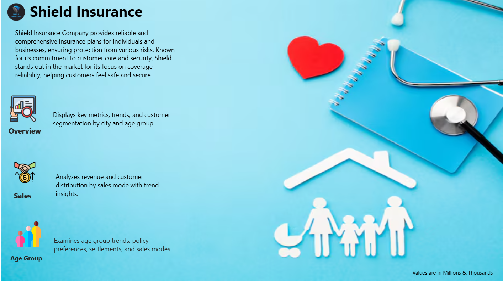
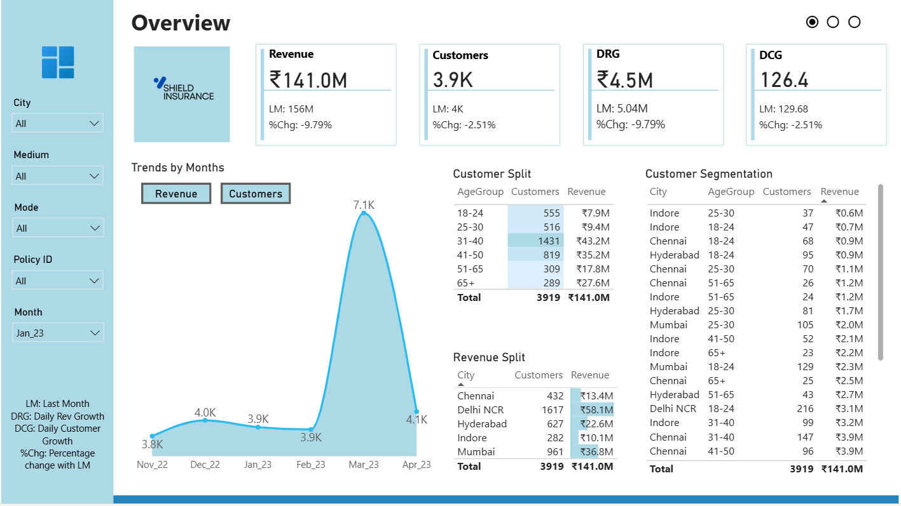
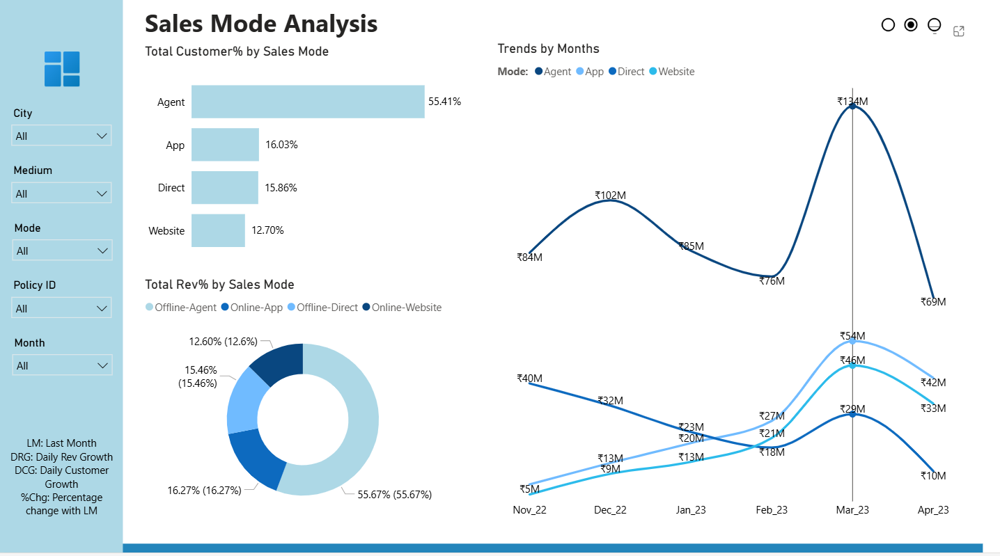
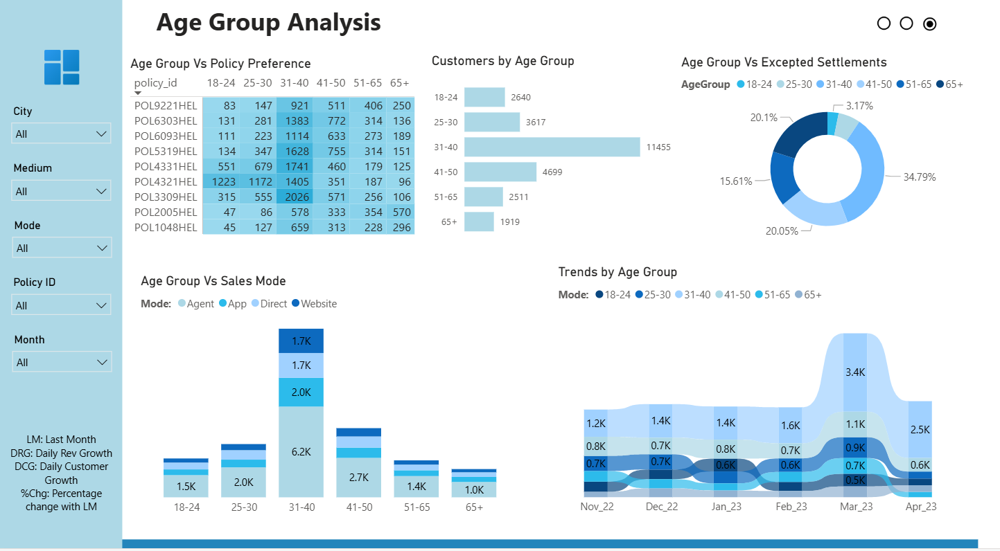

# 🛡️ Shield Insurance Dashboard (Power BI) — Codebasics Virtual Internship

This project is an end-to-end **Power BI dashboard** built for **Shield Insurance** as part of the **Codebasics Virtual Internship**.  
The report answers key business questions in seconds by tracking **Total Revenue**, **Total Customers**, **DRG/DCG (Daily Revenue & Customer Growth)**, monthly trends, and customer segmentation across **city, sales mode, age group, and policy ID**. 

## 📌 Project Overview

Shield Insurance provides comprehensive insurance plans for individuals and businesses. This dashboard is designed to help stakeholders quickly understand:
- how revenue and customer growth is trending month-over-month,
- where customers are coming from (city + demographic segments),
- how different sales modes contribute to revenue and customer acquisition,
- which age groups prefer which policies and channels.

> **Note:** Values are shown in **Millions & Thousands** across the report.

## 🎯 Business Questions Answered
- What are the **Total Revenue** and **Total Customers** this month vs last month?
- How are **DRG/DCG** changing (daily growth indicators)?
- What are the **monthly trends** for revenue and customers?
- Which **cities, age groups, and policies** contribute most?
- Which **sales modes** (Agent/App/Direct/Website) drive revenue vs customers?
- How do **age group behaviors** differ by policy preference, sales mode, and expected settlements?

## 📊 Core KPIs Tracked (Overview Page)
The Overview page highlights:
- **Revenue** (with Last Month and % change)
- **Customers** (with Last Month and % change)
- **DRG** — Daily Revenue Growth
- **DCG** — Daily Customer Growth 

Example shown for **Jan_23**:
- Revenue: **₹141.0M** (LM: 156M, %Chg: -9.79%)
- Customers: **3.9K** (LM: 4K, %Chg: -2.51%)
- DRG: **₹4.5M** (LM: 5.04M, %Chg: -9.79%)
- DCG: **126.4** (LM: 129.68, %Chg: -2.51%) 

## 🧩 Dashboard Pages

### 1) 📍 Overview
A business snapshot with:
- KPI cards (Revenue, Customers, DRG, DCG)
- Monthly trends (Revenue & Customers toggle)
- Customer split by **Age Group**
- Revenue split by **City**
- Detailed segmentation table (City + Age Group + Customers + Revenue)
- Filters for **City, Medium, Mode, Policy ID, Month**

📌 Add screenshot:

### 2) 💼 Sales Mode Analysis
This page breaks down performance by channel:
- **Total Revenue % by Sales Mode**
- **Total Customers % by Sales Mode**
- Monthly trend lines for each mode (Agent, App, Direct, Website)
- Filters for **Month, Policy ID, Mode, Medium, City** 

📌 Add screenshot:

### 3) 👥 Age Group Analysis
This page focuses on customer demographics and behavior:
- Trends by age group across months
- **Age Group vs Policy Preference** (policy-wise distribution)
- **Age Group vs Sales Mode**
- **Customers by Age Group**
- **Age Group vs Expected Settlements** distribution
- Filters for **City, Medium, Mode, Policy ID, Month** 

📌 Add screenshot:

## 🔍 Key Insights Included (From the Report Design)
- City-level contribution to revenue and customers (e.g., top city segments visible in Revenue Split table)
- Age-group contribution and customer distribution
- Clear separation of “**summary → deep-dive views**” via dedicated pages for:
  - Sales Mode insights
  - Age Group insights

## 🔧 Workflow (What I Did)
1. Imported the dataset into **Power BI**
2. Cleaned and structured the data in **Power Query**
3. Built a clean data model to support cross-filtering across:
   - City, Age Group, Policy ID, Mode, Medium, Month
4. Created DAX measures for:
   - Total Revenue, Total Customers
   - Last Month comparisons (LM)
   - % Change vs LM
   - DRG / DCG indicators
5. Designed a 3-page interactive report:
   - Overview (KPIs + trends + segmentation)
   - Sales Mode analysis
   - Age Group analysis 

## 🧠 Skills Used
- Power BI (dashboard design + storytelling)
- Power Query (data cleaning & transformation)
- DAX (KPIs, LM comparisons, DRG/DCG, % change)
- Data modeling (filter flow + segmentation-ready structure)
- Business reporting (trend + segmentation + drill-ready layouts)

## 💡 Business Value
This dashboard helps:
- **Leadership** monitor revenue and customer growth quickly (with LM and % change)
- **Sales teams** understand which channels drive revenue vs customer acquisition
- **Marketing teams** target the right segments by city and age group
- **Operations** track performance trends monthly and react faster to dips
- **Stakeholders** explore performance interactively using slicers (city, mode, policy, month) 

